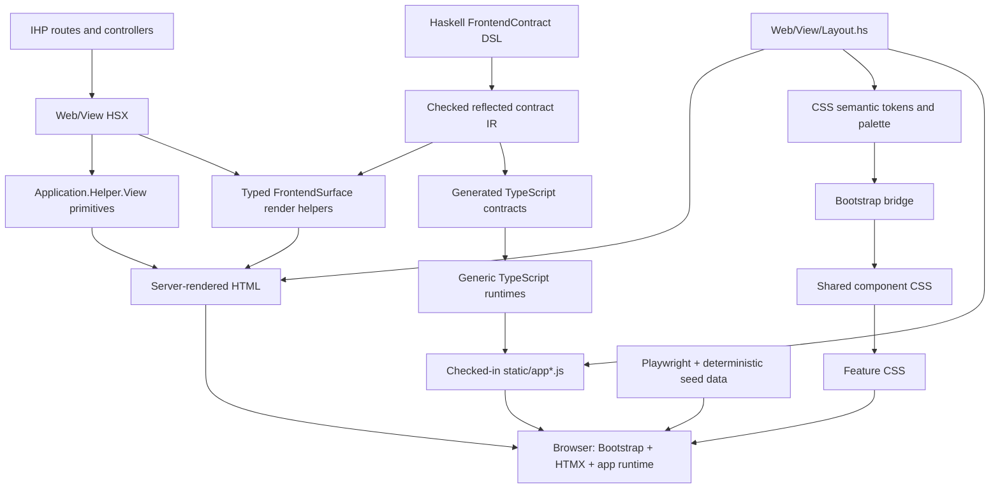
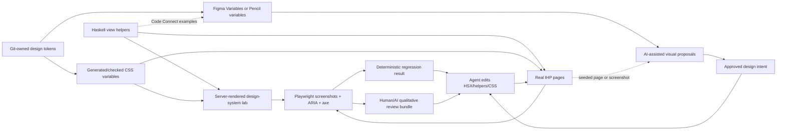

# AI-Assisted UI Design Workflow Research

Status: exploratory architecture/tooling spike  
Researched: 2026-07-12  
Repository evidence: `d7d8fe4c30611b3d068d5f418ce724435db6ff8f`

This is a recommendation, not an implemented contract or a replacement for
repo-local tickets. Existing focused UI polish remains tracked by `#117` and
its children. If the systemic workflow proposed here is approved, it should get
its own GitHub epic rather than being managed as a Markdown checklist.

## Recommendation In One Page

Do **not** replace the IHP/HSX/Bootstrap architecture with React, Tailwind,
Storybook, or an AI app builder. The current app already has the difficult
foundations needed for consistent design: semantic CSS tokens, focused CSS
ownership, shared Haskell view helpers, typed browser contracts, deterministic
data, Playwright, and Nix-pinned browser tooling.

Build the design workflow around those seams:

1. **Make the existing Playwright Agent CLI the immediate AI browser loop.** It
   is already exposed as `bash ./bin/in-env pwcli`, supports authenticated
   sessions, accessibility snapshots, element references, screenshots, and
   browser interaction, and is the best fit for a coding agent working in this
   repository.
2. **Add a server-rendered design-system lab.** Render production Haskell
   helpers and CSS in a development/support-only page. Do not duplicate HSX in
   Storybook stories.
3. **Add deterministic visual, ARIA, and accessibility checks around that lab.**
   Keep structural Playwright tests authoritative; use stable component-level
   screenshot baselines as a narrow hard gate and full-page screenshots as
   review artifacts.
4. **Use Figma MCP plus Code Connect as the preferred collaborative design
   bridge** if the required Figma plan is acceptable. Figma can expose variables,
   screenshots, component context, and Code Connect mappings to agents; its
   remote MCP can also write native canvas content and is rolling out web-page
   capture. Map Figma components to Haskell helpers, not to invented React
   components.
5. **Use Pencil as the strongest repo-native alternative/pilot.** Its `.pen`
   files are JSON and Git-friendly, it supports Linux, a CLI, MCP, variables,
   components, and shared design libraries. Treat generated HTML/CSS as visual
   input, not production output.
6. **Move tokens to Git-owned W3C Design Tokens Community Group (DTCG) JSON only
   after the design-canvas pilot proves useful.** Generate app CSS
   deterministically with Style Dictionary and sync the same values into Figma
   Variables/Tokens Studio or Pencil. Do not make a networked design service a
   Nix build dependency.
7. **Use v0, Builder, Stitch, and Figma Make only for disposable exploration for
   now.** Their generated application stacks do not understand IHP views,
   Haskell helper APIs, typed `FrontendSurface` contracts, HTMX response rules,
   or Bepis authorization.

The key principle is: **AI proposes and compares visual changes; checked-in
Haskell helpers, semantic tokens, and deterministic tests remain authoritative.**

## What Exists Today

### UI architecture



Source evidence:

- `Web/View/Layout.hs` owns the page shell, authenticated navigation, overlay
  hosts, and direct `assetPath` links.
- `Web/View/Prelude.hs` exposes IHP view APIs plus the focused helpers re-exported
  by `Application/Helper/View.hs`.
- `Application/Helper/View/Chrome.hs`, `Overlay.hs`, `Toast.hs`, `Status.hs`,
  `TimePicker.hs`, `ToggleButton.hs`, and `WeekToolbar.hs` already centralize
  important page/component structure.
- `Application/Helper/FrontendContract/README.md`,
  `Application/Helper/FrontendContract/Surface/README.md`, and
  `Application/Helper/Interaction.SPEC.md` make Haskell authoritative for
  browser-visible surface, fragment, action, intent, and interaction contracts.
- `static/css/README.md` defines a deliberate cascade from tokens through the
  Bootstrap bridge, shared components, overlays, and feature CSS.
- `Config/nix/flake/devenv-shell.nix` already supplies Node 22, TypeScript,
  esbuild, Graphviz, and the Nix-pinned Playwright browser/runtime. Production
  packaging in `Config/nix/flake/ihp-app.nix` stays Node-free.

The deterministic architecture query reported 17 reflected frontend surfaces,
1,360 generated TypeScript exports, and 31 generated-contract consumer files.
That is a substantial typed UI boundary which generated React/HTML from an
external app builder would bypass.

### Styling baseline

A current source scan found:

- 40 app-owned CSS files and about 5,490 lines;
- approximately 197 custom-property definitions across the token/palette layer;
- 18 focused shared view-helper modules;
- 45 HSX view modules;
- direct use of `renderAppPage`, `renderAppPanel`, shared dialogs, status badges,
  toggles, time pickers, week toolbars, and typed surface mounts across the app.

`bash ./bin/in-env ./bin/style-audit` passes all hard gates:

- no undefined variables;
- Layout/Makefile asset order is synchronized;
- no app-owned `@import`;
- no CSS file exceeds the 1,000-line budget;
- no unapproved raw colours outside token/palette/bridge ownership;
- no unexpected global selectors in feature CSS.

The review-only output currently finds two light-mode Bootstrap utility uses and
three inline styles, all in already identified narrow locations. This means the
next problem is primarily **visual direction and component saturation**, not a
need to rebuild the CSS architecture.

### Existing visual verification

The repository already has:

- deterministic E2E fixtures and seeded development scenarios;
- desktop, Pixel 7, Galaxy S9+, and iPad Mini Playwright projects;
- structural responsive assertions for overflow, dialogs, navigation, sticky
  panels, toolbars, and density;
- `screenshot-page`, authenticated Playwright CLI state, and roster screenshot
  diagnostics;
- a styling regression spec that checks computed CSS and loaded assets.

What it does not yet have is a small canonical component gallery, an approved
visual language documented alongside that gallery, or a stable cross-page
visual-review matrix.

### Visual assessment

The latest usable repository screenshots show a coherent, functional dark UI
with strong operational density and increasingly consistent panels, dialogs,
accordions, and responsive behavior. The design-system refactor has clearly
worked.

The next visual opportunities are:

- **Brand character:** much of the interface still reads as carefully themed
  Bootstrap. Typography, icon usage, accent strategy, and distinctive page
  patterns could communicate Bepis more strongly.
- **Hierarchy:** many nested areas use similarly weighted dark surfaces and
  borders. Important tasks and information can compete with secondary chrome.
- **Component saturation:** repeated patterns are partly helper-backed, but raw
  cards, badges, tables, and Bootstrap utility combinations still occur.
- **Mobile information architecture:** mobile views are functional, but long
  profile/preferences forms and nested panels create substantial vertical
  repetition. Better grouping and progressive disclosure matter more than
  merely shrinking spacing.
- **State completeness:** a durable design system should show empty, loading,
  error, read-only, disabled, validation, permission-gated, long-content, and
  live-refresh states, not only happy-path components.
- **Visual regression:** current tests strongly protect structure, but most
  screenshots are diagnostics rather than reviewed canonical baselines.

A fresh screenshot run was attempted during this research, but the current dirty
worktree is in the middle of a `FrontendSurface` migration and the dev server
currently reports pre-existing compile errors around removed
`rosterSurfaceAction` imports. The visual assessment therefore uses current
source/tests plus the latest stored development screenshots (May-June 2026), not
claims of pixel-perfect current rendering.

## Tool Research And Fit

### 1. Playwright Agent CLI — adopt now

**Fit: excellent; already present.**

Playwright describes its CLI as the better fit for coding agents because concise
CLI/skill calls are more token-efficient than loading MCP schemas and large page
trees. It supports accessibility snapshots with exact element refs, screenshots,
multiple named sessions, persistent browser state, and headed monitoring. The
repository already wraps it in `pwcli` and provides role-specific authentication
state.

Use it for the implementation loop:

1. open a seeded page/state;
2. inspect the accessibility snapshot;
3. capture desktop/mobile screenshots;
4. edit HSX/helper/CSS code;
5. reload and compare;
6. turn stable discoveries into Playwright assertions.

Sources: [Playwright Agent CLI introduction](https://playwright.dev/agent-cli/introduction),
[capabilities](https://playwright.dev/agent-cli/capabilities),
[snapshots](https://playwright.dev/agent-cli/snapshots), and the
[official CLI repository](https://github.com/microsoft/playwright-cli).

### 2. Figma MCP + Code Connect — preferred collaborative design bridge

**Fit: very good, with plan/client constraints.**

Figma's remote MCP exposes design context such as variables, components,
layouts, screenshots, and Code Connect data. The current beta can write native
Figma frames, components, variables, and auto-layout; Figma is also rolling out
web-page-to-Figma capture. The remote endpoint uses OAuth and does not need a
Linux desktop app.

Code Connect is the important part for Bepis. It replaces generic generated
snippets with production design-system examples and property mappings. Its
template files are framework-agnostic, and custom parsers are available, so
Figma components can point to examples such as `renderAppPanel`,
`renderAppStatusBadge`, `renderDialogOverlay`, and `renderWeekToolbar` rather
than React components. Figma states that Code Connect requires an Organization
or Enterprise plan plus an eligible Design/Dev Mode seat.

Recommended use:

- mirror Git-owned semantic tokens into Figma Variables and set CSS code syntax
  such as `var(--app-surface)`;
- create Figma components/variants that match production Haskell primitives;
- connect those components to Haskell helper examples;
- import a seeded Bepis page or screenshot, explore alternatives in Figma, and
  give the approved frame URL to an AI coding client;
- manually review every implementation in the real IHP app.

Do not treat Figma-generated web code as production code.

Sources: [Figma MCP guide](https://github.com/figma/mcp-server-guide),
[developer documentation](https://developers.figma.com/docs/figma-mcp-server/),
[remote server setup](https://developers.figma.com/docs/figma-mcp-server/remote-server-installation/),
[tools and prompts](https://developers.figma.com/docs/figma-mcp-server/tools-and-prompts/),
[Code Connect](https://github.com/figma/code-connect), and
[custom parsers](https://developers.figma.com/docs/code-connect/custom-parsers/).

### 3. Git-owned DTCG tokens + Style Dictionary — consistency foundation

**Fit: excellent after a small pilot; not itself an AI tool.**

The W3C Design Tokens Community Group published its stable format report in
October 2025. Tokens Studio can store DTCG JSON in Git, map token sets/themes to
Figma Variable collections/modes, and import/export Figma Variables. Style
Dictionary understands DTCG tokens and can generate CSS custom properties.

The safe source-of-truth direction is:

```text
checked-in DTCG JSON -> deterministic Style Dictionary build -> app CSS
                     -> design-tool import/sync -> Figma/Pencil variables
```

Do not reverse this so a Figma API call is required to build Bepis. Keep network
sync opt-in and keep generated CSS checked for drift.

Sources: [W3C DTCG format report](https://www.w3.org/community/reports/design-tokens/CG-FINAL-format-20251028/),
[Style Dictionary DTCG support](https://styledictionary.com/info/dtcg/),
[Tokens Studio token formats](https://docs.tokens.studio/manage-settings/token-format),
[GitHub sync](https://docs.tokens.studio/token-storage/remote/sync-git-github), and
[Figma Variable import/export](https://docs.tokens.studio/figma/import/variables/).

### 4. Pencil — strongest repo-native design-canvas pilot

**Fit: promising, especially for a solo/small team on Linux.**

Pencil documents `.pen` files as JSON and Git-friendly, supports Linux through
editor extensions/AppImage/deb, offers reusable components, variables, shared
`.lib.pen` libraries, a CLI, and MCP-based AI integration. That makes it much
closer to a Nix/repository workflow than a browser-only prototype tool.

Caveats:

- the product and ecosystem are newer than Figma;
- its integrated AI workflow currently documents Claude Code as a prerequisite;
- exported React/HTML/CSS still does not express Bepis Haskell helpers or typed
  interaction contracts;
- design-file merge behavior and CLI stability should be proven on one page
  before making `.pen` files authoritative.

Use it as an alternative to Figma, not a second simultaneous design source.

Sources: [Pencil installation](https://docs.pencil.dev/getting-started/installation),
[AI integration](https://docs.pencil.dev/getting-started/ai-integration),
[Git-friendly `.pen` files](https://docs.pencil.dev/core-concepts/pen-files),
[design libraries](https://docs.pencil.dev/core-concepts/design-libraries), and
[CLI](https://docs.pencil.dev/for-developers/pencil-cli).

### 5. Penpot MCP — open-source/self-hostable alternative

**Fit: credible but operationally heavier.**

Penpot has an official MCP server capable of querying, transforming, and
creating design content through its Plugin API. Penpot also supports components,
variants, libraries, and W3C-compatible design tokens. The current MCP setup
requires a Node 22 server, a locally served Penpot plugin, a WebSocket bridge,
and an MCP client, so it adds more moving pieces than Pencil or Figma's remote
service.

It is worth considering when open source/self-hosting is a requirement, not as
the default first experiment.

Sources: [official Penpot MCP repository](https://github.com/penpot/penpot-mcp),
[Penpot MCP docs](https://help.penpot.app/mcp/), and
[design tokens](https://help.penpot.app/user-guide/design-systems/design-tokens/).

### 6. Visual QA services — optional later

Start with Playwright's built-in `toHaveScreenshot`, ARIA snapshots, and
`@axe-core/playwright`. The Nix-pinned Chromium environment and deterministic
fixtures are unusually good foundations for stable local comparisons.

If review volume outgrows local baselines:

- **Chromatic for Playwright** adds hosted PR review and browser snapshots
  without requiring Storybook.
- **Applitools Eyes** adds its Visual AI matching and Playwright SDK, which may
  reduce maintenance for dynamic or cross-browser views, but introduces SaaS,
  credentials, and cost.

Neither service should be the first step. Prove that the selected screenshot
matrix is stable and valuable locally first.

Sources: [Playwright visual comparisons](https://playwright.dev/docs/test-snapshots),
[ARIA snapshots](https://playwright.dev/docs/aria-snapshots),
[accessibility testing](https://playwright.dev/docs/accessibility-testing),
[Chromatic for Playwright](https://www.chromatic.com/docs/playwright/), and
[Applitools Playwright integration](https://applitools.com/solutions/playwright/).

### 7. Generative app builders — use only for disposable concepts

| Tool | Useful for | Why it should not own Bepis implementation |
| --- | --- | --- |
| Figma Make local code | Visual annotation and AI edits directly against a local codebase; PR creation | As of May 2026 this is a limited Mac desktop beta. It has not proved the IHP/Haskell/HSX path on NixOS. [Official announcement](https://www.figma.com/blog/figma-make-now-on-your-local-code/) |
| v0 | Fast layout/style alternatives and screenshot-driven prototypes | Its most reliable path is React/Next.js with TypeScript/Tailwind; direct output conflicts with the app architecture. [Git import](https://v0.app/docs/git-import), [full-stack guidance](https://v0.app/docs/full-stack-apps), [design mode](https://v0.app/docs/design-mode) |
| Builder Fusion / Visual Copilot | Figma-to-code experiments; it can generate HTML as well as JS frameworks | Generic HTML does not preserve Haskell helper, route, authorization, HTMX, or `FrontendSurface` ownership. [Generate Code](https://site.builder.io/c/docs/generate-code), [repository projects](https://www.builder.io/c/docs/fusion-projects-from-repositories) |
| Google Stitch | Prompt/image-to-UI ideation and Figma/code export | It is a concept-generation handoff, not an existing-IHP-repository integration. [Official announcement](https://developers.googleblog.com/en/stitch-a-new-way-to-design-uis/) |

A prototype from one of these tools can be accepted as a screenshot, Figma
frame, spacing/color proposal, or isolated HTML reference. An agent must then
translate it into Bepis semantic tokens and Haskell helpers. Do not merge its
runtime scaffold.

## Target Design Workflow



### Sources of truth

| Concern | Source of truth |
| --- | --- |
| Business behavior, authorization, routes, rendered DOM | IHP controllers and Haskell HSX/views |
| Shared component markup | `Application/Helper/View/*` |
| Dynamic interaction, live fragments, browser contracts | Haskell `FrontendContract`/`SurfaceImpl` definitions |
| Visual constants | initially `static/css/tokens.css`; later Git-owned DTCG JSON |
| Bootstrap integration and cascade | `static/css/README.md`, Layout, and `Makefile` |
| Approved visual intent | one selected Figma **or** Pencil design system/frame |
| Regression behavior | Hspec, frontend checks, and structural Playwright tests |
| Stable visual regression | narrow Playwright component/shell screenshots |
| Qualitative visual critique | human or multimodal AI review; never a deterministic gate |

## Proposed Repository And Nix Integration

This is a target shape, not a request to add every file immediately:

```text
design/
  README.md                     # source-of-truth and handoff rules
  tokens/                       # optional DTCG JSON after pilot
  figma-code-connect/           # optional helper mappings
  pencil/                       # optional .pen files; not alongside Figma authority

Web/View/Support/DesignSystem.hs # production-helper gallery, dev/support gated

e2e/
  ui-design-system.spec.ts      # stable component/state visual + ARIA checks
  ui-review.spec.ts             # non-gating page/role/viewport review captures

Config/nix/scripts/ui/
  review
  visual-test
  design-tokens-build
  design-tokens-check
  figma-code-connect-check      # optional, local validation
  figma-code-connect-publish    # optional, networked/manual
```

Expose commands through `Config/nix/flake/scripts.nix`, following the existing
pattern:

```bash
bash ./bin/in-env ui-review
bash ./bin/in-env ui-visual-test
bash ./bin/in-env design-tokens-build
bash ./bin/in-env design-tokens-check
bash ./bin/in-env design-system-check
```

`design-system-check` should compose deterministic local gates only:

```text
design-token drift (if adopted)
+ style-audit
+ focused Haskell helper/render tests
+ design-lab visual snapshots
+ ARIA snapshots
+ axe scan
```

### Tool-to-Nix mapping

| Capability | Repository integration |
| --- | --- |
| Agent browser iteration | Keep the existing Nix-pinned Playwright input and `pwcli`, `pwcli-auth-*`, `screenshot-page`, and E2E wrappers. |
| Visual/ARIA/accessibility gates | Add `@axe-core/playwright` as an exact dev dependency and invoke the existing `@playwright/test` package from a Nix script. No additional browser download. |
| Design tokens | Pin Style Dictionary as a dev dependency (or explicit Nix package), expose build/check scripts, and check generated CSS drift before `style-audit`. |
| Figma design context | The OAuth-backed remote MCP remains a design-client service, not a Nix build input. Pin only the Code Connect CLI/templates needed to validate or publish Haskell helper mappings. |
| Pencil pilot | Pin `@pencil.dev/cli` as a dev dependency and expose focused render/check/export commands; keep its AI authentication outside hermetic checks. |
| Penpot pilot | If selected, package its Node 22 MCP/plugin servers as an opt-in devenv process rather than a production service. |
| Hosted visual review | Wrap Chromatic/Applitools upload commands as explicit networked scripts requiring environment credentials; never make them necessary for local compilation. |

### Dependency policy

- Keep all design/browser tooling in the development shell, never
  `ihp.packages` for production.
- Pin Node CLIs as exact dev dependencies in `package.json`/`package-lock.json`
  or as explicit Nix inputs; invoke them through repository scripts, not global
  installs.
- Reuse the existing `pwcli` wrapper first. The Agent CLI is pinned as an exact
  development dependency and invoked with `npx --no-install`; its nested alpha
  Playwright runtime remains distinct from the stable test runner. Do not force
  those runtimes to share a version merely for tidiness.
- Keep Figma publish/sync, Tokens Studio sync, Chromatic, and Applitools commands
  opt-in and credentialed. They must not run during a hermetic Nix build.
- Preserve direct `assetPath` CSS loading. A token compiler is a deterministic
  source generator, not a reason to add Vite, PostCSS, true HMR, or a production
  Node dependency.

## The Design-System Lab

The most valuable new abstraction is not another CSS framework. It is a page
that makes the existing abstractions visible and reviewable.

Render real production helpers for:

- token swatches, typography, spacing, radii, shadows, and density modes;
- page header, panel, section, and empty-state patterns;
- every button purpose, size, icon placement, destructive state, and loading
  state;
- form controls with normal, focus, disabled, read-only, validation, help, and
  long-label states;
- neutral/success/warning/danger/info badges and alerts;
- tables, cards/lists, menus, accordions, and week navigation;
- dialogs, toasts, picker lane, and overlay combinations;
- lazy/loading/error/retry/live-refresh regions;
- touch, keyboard, narrow viewport, long content, and compact/normal/large
  density examples.

Rules:

- use production helper functions and production CSS;
- use deterministic synthetic text/data only;
- gate the route to development or founder support;
- do not mount real collaborative subscriptions unless that state is what the
  example is proving;
- give each example a stable id/data hook for focused screenshots;
- keep feature-specific specimens (roster shift cards, timelines, timesheet
  entries) beside shared primitives without pretending they are generic.

A Storybook HTML story would duplicate the HSX output and miss IHP request
context, routes, HTMX attributes, generated contracts, and overlay mounts. The
real app is already the correct renderer.

## Reliable Review Strategy

Use four different review tiers instead of making every screenshot a brittle
hard gate.

### Tier A — deterministic component visuals

Hard gate a small set of stable design-lab specimens with
`toHaveScreenshot`. Pin viewport, browser, density, data, time zone, fonts, and
animation/caret behavior. Commit only approved baselines.

### Tier B — structural product behavior

Keep the existing Playwright style: assert overflow ownership, target size,
dialog fit, sticky behavior, semantic roles, visible actions, and concrete HTMX
outcomes. These tests survive intentional visual redesign better than pixels.

### Tier C — qualitative page review

`ui-review` should produce an ignored artifact directory containing:

- desktop/mobile screenshots for named routes, roles, and states;
- focused shell/component screenshots;
- accessibility snapshots and axe results;
- viewport/overflow/layout metrics;
- the style-audit and CSS-inventory summaries;
- a manifest describing commit, route, role, viewport, density, selector, and
  setup state.

A human or multimodal agent reviews this bundle against a stable rubric:
hierarchy, consistency, readability, contrast, touch/keyboard use, content
stress, empty/error/loading states, and preservation of operational density.
The AI review is advice, not pass/fail truth.

### Tier D — optional hosted review

Only after Tier A-C are stable, trial Chromatic or Applitools on the same
Playwright scenarios. Do not create a second scenario inventory for a SaaS tool.

## How New UI Should Be Built

For every approved design change:

1. Identify whether it is a token, shared component, page pattern, or genuinely
   feature-specific rule.
2. Update the narrowest source of truth first: token, Haskell helper, shared CSS,
   or feature CSS.
3. Render normal plus edge states in the design-system lab.
4. Implement the real page through the helper; do not paste generated HTML or
   invent raw `data-bepis-*` attributes.
5. Use Playwright CLI for visual iteration against seeded data.
6. Run `style-audit`, typecheck, focused behavior tests, visual specimens, ARIA,
   and accessibility checks.
7. Update Code Connect/design-library mappings when a shared component API or
   variant changes.
8. Update the nearest living README/SPEC/AGENTS documentation when the component
   contract changes.

AI output should be rejected or translated when it introduces:

- raw colours outside the token layer;
- one-off inline layout styles;
- global feature overrides;
- copied panel/dialog/form markup where a helper exists;
- React/Tailwind/Vite runtime code;
- arbitrary `data-bepis-*`, HTMX routes, targets, or mutation URLs;
- browser-owned business DOM;
- production customer data in external design tools.

## Adoption Sequence

### Phase 1 — exploit the current foundation

- Formalize a `ui-review` Playwright capture matrix around current seeded data.
- Add a reusable visual-review rubric for agents/humans.
- Keep screenshots non-gating while the matrix stabilizes.
- Continue focused polish through `#117` without waiting for a new design
  platform.

### Phase 2 — expose and test the component system

- Add the server-rendered design-system lab.
- Document component purposes and allowed variants.
- Add narrow screenshot, ARIA, and axe coverage for stable specimens.
- Promote repeated raw markup into helpers only where actual repetition is
  demonstrated.

### Phase 3 — one design-canvas pilot

Choose exactly one:

- **Figma** when collaboration, mature design tooling, and Code Connect justify
  its plan cost; or
- **Pencil** when Git-native files, Linux, and a lightweight solo workflow are
  more valuable.

Pilot one contained surface such as profile/preferences or leave—not the dense
roster editor first. Measure whether the tool improves iteration speed and
component reuse before expanding.

### Phase 4 — unify tokens if the pilot succeeds

- Convert the stable semantic subset to DTCG JSON.
- Generate CSS deterministically and add a drift check.
- Mirror the same values into the chosen design tool.
- Keep CSS-only computed/layout tokens in an explicit generated/custom-format
  layer rather than forcing every expression into a primitive token.

### Phase 5 — optional hosted visual review

Trial one service against the existing Playwright matrix only if local review
has become a collaboration bottleneck.

## Decision

The best near-term investment is **not buying an AI UI generator**. It is turning
Bepis's existing Nix + Playwright + Haskell helper system into a visible,
repeatable design loop.

Recommended stack:

```text
Now:       Bepis helpers/tokens + Playwright Agent CLI + design-system lab
Design:    Figma MCP/Code Connect (preferred) OR Pencil (repo-native alternative)
Tokens:    Git-owned DTCG JSON + Style Dictionary, after the pilot
Quality:   Playwright structural + narrow visual + ARIA + axe checks
Optional:  Chromatic or Applitools after local scenarios prove stable
Avoid:     direct v0/Builder/Stitch/Figma-Make output in production
```

This preserves the app's unusually strong typed/server-rendered architecture
while adding the fast visual feedback, shared design context, and repeatable
consistency checks needed for the next stage of product polish.
